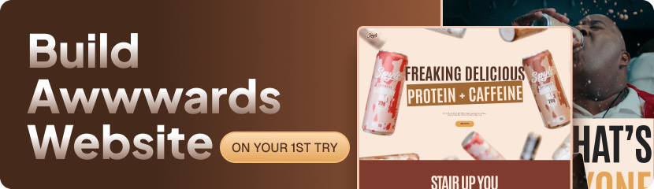

<div>
  <br />
  <div align="center">
    <a href="https://youtu.be/pqYxZ8jd768" target="_blank">
      
    </a>
  </div>

 <div>
    
    
    
  </div>
</div>

# GSAP Awwwards-Inspired Website

A modern and visually stunning front-end project inspired by Awwwards-winning websites. This project showcases a variety of advanced web animations and interactive effects, built with the powerful GreenSock Animation Platform (GSAP) and Locomotive Scroll.

### [✨ View Live Demo ✨](https://dhlananhh.github.io/GSAP-Awwwards-Website/)

---


_(**Note:** Please replace this with a screenshot or a GIF of your project!)_

## 📖 About The Project

This project is a creative exploration of modern web design and animation techniques. The goal was to build a fluid, engaging, and memorable user experience similar to those celebrated on Awwwards. It leverages GSAP for complex timeline-based animations and Locomotive Scroll for smooth, parallax-style scrolling effects.

Key learning and implementation points include:

- Creating a seamless page loader.
- Implementing a custom mouse cursor.
- Triggering animations on scroll events.
- Choreographing text and image reveals for a dynamic feel.

## 🛠️ Built With

This project was built using a curated set of modern front-end technologies:

- **[HTML5](https://developer.mozilla.org/en-US/docs/Web/Guide/HTML/HTML5)**
- **[CSS3](https://developer.mozilla.org/en-US/docs/Web/CSS)**
- **[JavaScript (ES6+)](https://developer.mozilla.org/en-US/docs/Web/JavaScript)**
- **[GSAP (GreenSock Animation Platform)](https://greensock.com/gsap/)**: A professional-grade JavaScript library for high-performance animations.
- **[Locomotive Scroll](https://locomotivemtl.github.io/locomotive-scroll/)**: A library that provides smooth scrolling with parallax effects.

## ✨ Features

The website includes a range of carefully crafted features to enhance the user experience:

- **Preloader Animation**: A stylish loading screen that smoothly transitions into the main content.
- **Custom Cursor Follower**: An interactive cursor that changes based on hoverable elements.
- **Smooth Scrolling**: Fluid scrolling powered by Locomotive Scroll, creating a premium browsing feel.
- **Scroll-Triggered Animations**: Elements, text, and images animate into view as the user scrolls down the page.
- **Text Reveal Effects**: Engaging typography animations that draw the user's attention.
- **Hover-Activated Image Effects**: Interactive effects on links and images upon mouse hover.
- **Fully Responsive Design**: A layout that adapts gracefully to different screen sizes, from mobile devices to desktops.

## 🚀 Getting Started

To get a local copy up and running, follow these simple steps.

### Prerequisites

You only need a modern web browser. No complex dependencies or build tools are required.

### Installation

1. **Clone the repository:**

   ```sh
   git clone https://github.com/dhlananhh/GSAP-Awwwards-Website.git
   ```

2. **Navigate to the project directory:**

   ```sh
   cd GSAP-Awwwards-Website
   ```

3. **Open the project:**
   Simply open the `index.html` file in your web browser.

   For the best experience (to avoid potential browser restrictions), it is recommended to serve the files using a local server. If you have VS Code, you can use the [Live Server](https://marketplace.visualstudio.com/items?itemName=ritwickdey.LiveServer) extension.

## 📄 License

Distributed under the MIT License. See `LICENSE` for more information.

## 🙏 Acknowledgments

- Inspiration from various Awwwards websites.
- GreenSock for the incredible GSAP library.
- The developers behind Locomotive Scroll.
